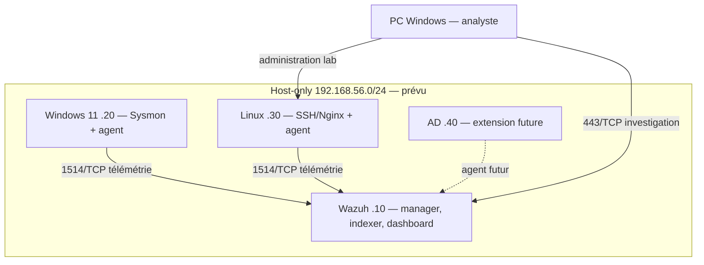

# Architecture prévue — non déployée

## Ressources
| VM | OS | vCPU | RAM | Disque dynamique maximal | IP lab prévue |
|---|---|---:|---:|---:|---|
| aegis-wazuh | Ubuntu Server 24.04 LTS amd64 | 4 | 8 Go | 80 Go | 192.168.56.10 |
| aegis-win11 | Windows 11 Enterprise évaluation | 2 | 4 Go | 80 Go | 192.168.56.20 |
| aegis-linux | Ubuntu Server 24.04 LTS amd64 | 2 | 2 Go | 30 Go | 192.168.56.30 |
| aegis-dc, futur | Windows Server évaluation | à mesurer | à mesurer | à définir | 192.168.56.40 |

Wazuh recommande 4 vCPU, 8 GiB et 50 GB pour 1–25 agents. Ubuntu 24.04 est dans sa liste d'OS recommandés : https://documentation.wazuh.com/current/quickstart.html (consulté le 2026-10-01).
Les 80 Go choisis laissent une marge ; la rétention réelle sera mesurée et réglée.

Les trois VM utilisent 14 Go : insuffisant pour laisser un budget confortable à Windows hôte. Mode normal : Wazuh + Linux (10 Go), ou Wazuh + Windows (12 Go, serré). Fermer les applications lourdes et mesurer la mémoire disponible ; ne pas promettre trois VM simultanées. AD remplacera temporairement un endpoint ; les scénarios multi-machines nécessiteront un nouveau budget. Le GPU n'est pas nécessaire.

Prévoir environ 250 Go libres sur SSD pour disques, ISO et quelques snapshots ; vérifier l'espace réel. Les disques dynamiques grossissent et les snapshots consomment du stockage. Un snapshot ne remplace pas une sauvegarde.

## Réseau
VirtualBox, sans Extension Pack requis. Carte 1 NAT temporaire pour installations/mises à jour ; carte 2 host-only commune pour le lab. Réseau proposé 192.168.56.0/24, à confirmer sans conflit avec VPN/LAN existant.
Hôte 192.168.56.1 ; DHCP host-only désactivé ; IP VM statiques. Pas de passerelle ni DNS sur la carte lab. La route Internet vient du NAT.

Host-only permet au PC d'accéder au dashboard et aux VM de communiquer. Ce n'est pas un isolement du PC hôte. Aucun malware réel. Aucun bridge, partage de dossier, presse-papiers partagé, redirection de port ou routage/ICS sur l'hôte. Déconnecter le NAT des endpoints avant les scénarios ; maintenir l'heure cohérente et consigner UTC.

## Topologie

## Flux à autoriser et vérifier
| Source | Destination | Port | Usage |
|---|---|---|---|
| Endpoints | Wazuh .10 | TCP 1514 | Télémétrie agents |
| Endpoints | Wazuh .10 | TCP 1515 | Enrôlement, accès limité |
| Hôte .1 | Wazuh .10 | TCP 443 | Dashboard |
| Hôte .1 | VM Linux | TCP 22 | Administration |
| Client lab choisi | Linux .30 | TCP 22,80 | Scénarios SSH/HTTP |

Indexer 9200 et API 55000 : pas d'ouverture générale aux endpoints. Les flux internes de l'installation tout-en-un seront vérifiés. Filtrage pare-feu après validation des interfaces, avec accès console conservé.
